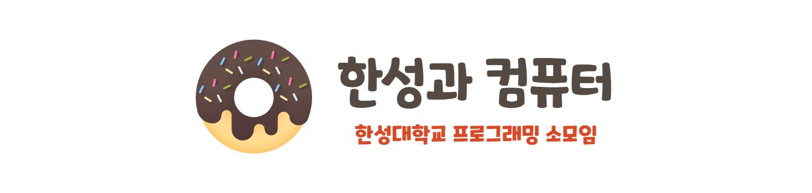

## **한성대학교 프로그래밍 소모임 - 한성과 컴퓨터**
Hansung Univ. Programming Group - Hansung & Computer (HSAC)

    🏃‍♂️🏃‍♀️ 여러분과 함께 달리는 러닝메이트! 한성과 컴퓨터! 🏃‍♂️🏃‍♀️

---

## 🥇 **한성과 컴퓨터를 소개합니다!**
**2023년 1월에 소모임이 결성되어 처음부터 차근차근 달려나가는 중이에요! 🏊‍♀️🏊‍♂️**
    
    
    1. 개발 공부는 해보고 싶은데, 혼자 시작하기에는 막막한 여러분들을 위한 소모임이에요!
    2. 어렵지 않아요! 다들 초보이기 때문에 포기하지 않고 달려간다면 원하는 경지에 도달할 수 있을거에요!
    3. 처음부터 같이 달려온 친구들과 함께 공모전도 준비해봐요! 

---
## **👨‍👩‍👦 한성과 컴퓨터 구성입니다!**
**한성과 컴퓨터는 다음 스터디팀으로 구성되어 운영되고 있습니다!**

**[🔥 개발반]**
      
    개발을 처음 시작하는 분들을 위한 스터디입니다! 처음부터 천천히 개발에 대하여 학습하고 있습니다!

- **[ 모바일 제작팀 ]**\
  
  
  
  + [모바일 제작팀 A <팀장 : 박종범>](https://github.com/TeamHSAC/HSAC/tree/main/StudyProject/Develop/Mobile/TeamA)
  + [모바일 제작팀 B <팀장 : 박채영>](https://github.com/TeamHSAC/HSAC/tree/main/StudyProject/Develop/Mobile/TeamB)

- **[ 웹 프로그래밍 팀 ]**\

  - [웹 프로그래밍팀 A <팀장 : 장영훈>](https://github.com/TeamHSAC/HSAC/tree/main/StudyProject/Develop/Web/TeamA)
  - [웹 프로그래밍팀 B <팀장 : 김기환>](https://github.com/TeamHSAC/HSAC/tree/main/StudyProject/Develop/Web/TeamB)
  - [웹 프로그래밍팀 C <팀장 : 김민규>](https://github.com/TeamHSAC/HSAC/tree/main/StudyProject/Develop/Web/TeamC)
  - [웹 프로그래밍팀 D <팀장 : 장민권>](https://github.com/TeamHSAC/HSAC/tree/main/StudyProject/Develop/Web/TeamD)

- **[ 게임 개발 팀 ]**\

  - [게임 개발팀 A <팀장 : 곽승준>](https://github.com/TeamHSAC/HSAC/tree/main/StudyProject/Develop/Game/TeamA)
  - 게임 개발팀 B
  
---

**[🤗 기초반]**

    본격적인 프로그래밍 학습 전에 필수적인 컴퓨터 과학 지식을 공부하는 스터디입니다!

- **[ C언어 기초반 ]**\

  + [C언어 기초반 A <팀장 : 고현아>](https://github.com/TeamHSAC/HSAC/tree/main/StudyProject/Basic/C%20Language/TeamA)
  + [C언어 기초반 B <팀장 : 신정인>](https://github.com/TeamHSAC/HSAC/tree/main/StudyProject/Basic/C%20Language/TeamB)
  + [C언어 기초반 C <팀장 : 이학현>](https://github.com/TeamHSAC/HSAC/tree/main/StudyProject/Basic/C%20Language/TeamC)

- **[ 자료구조 + 알고리즘 기초반]**\

  + [자료구조/알고리즘 기초반 A <팀장 : 조유진>](https://github.com/TeamHSAC/HSAC/tree/main/StudyProject/Basic/Data%20Structure%26Algorithm/TeamA)
  + [자료구조/알고리즘 기초반 B <팀장 : 박지원>](https://github.com/TeamHSAC/HSAC/tree/main/StudyProject/Basic/Data%20Structure%26Algorithm/TeamB)
  + [자료구조/알고리즘 기초반 C <팀장 : 이소민>](https://github.com/TeamHSAC/HSAC/tree/main/StudyProject/Basic/Data%20Structure%26Algorithm/TeamC)
  + [자료구조/알고리즘 기초반 D <팀장 : 이재욱>](https://github.com/TeamHSAC/HSAC/tree/main/StudyProject/Basic/Data%20Structure%26Algorithm/TeamD)

- **[코딩테스트 준비반]**\

  + [코팅테스트 기초반 A <팀장 : 김진하>](https://github.com/TeamHSAC/HSAC/tree/main/StudyProject/Basic/Coding%20Test/TeamA)
  + [코딩테스트 기초반 B <팀장 : 김다희>](https://github.com/TeamHSAC/HSAC/tree/main/StudyProject/Basic/Coding%20Test/TeamB)
  + [코딩테스트 준비반 C <팀장 : 박종범>](https://github.com/TeamHSAC/HSAC/tree/main/StudyProject/Basic/Coding%20Test/C++)

- **[컴퓨터구조 + 운영체제 기초반]**\

  + [컴퓨터구조 & 운영체제 기초반](https://github.com/TeamHSAC/HSAC/tree/main/StudyProject/Basic/hsac.basic.csos)

---

## 📢 공지사항
> 2023-05-08 README.md 수정

### `5월 4일 팀장 회의 공지`

### `📌 프로젝트 매니저 선발`

- 기말고사가 종료 된 이후, 본격적인 프로젝트 개발이 진행될 계획입니다. 따라서 프로젝트를 이끌 수 있는 프로젝트 매니저를 새롭게 선발할 계획입니다.
- 프로젝트 매니저는 `5월 8일부터 5월 12일`까지 모집 진행하겠습니다. 실력은 크게 상관 없습니다! 만들어 보고 싶은 서비스가 있다고 생각되시는 분은 바로 지원주시면 감사하겠습니다!

### `📌 팀 리빌딩 관련`

- 프로젝트 매니저(이하 PM)가 선발된 이후, PM은 여러분이 작성한 포트폴리오를 기반으로 팀원을 선발하여 팀을 구성하게 됩니다. 
- 각 개인의 포트폴리오는 `5월 19일`까지 받도록 하겠습니다. 해당 양식은 13일에 PM 회의 이후 14일에 공지하도록 하겠습니다.
 

### `📌 기초반 안내`

- 여름방학 이후 기초반을 대폭 축소할 예정입니다. 1, 2학년 위주로 2팀 정도 예상하고 있습니다. 그 외 인원들은 모두 프로젝트 제작에 참여하게 될 예정입니다. 다만, 여름방학 시작하고 바로 개발에 들어가는 것이 아닌, 아이디어 회의와 개발 학습도 동반될 예정이니 너무 걱정 안하셔도 좋을 것 같습니다!

### `📌 유령회원 안내`
- 각 팀장분들은 현재까지 활동 중 70% 이상 참여하지 아니한 팀원들 명단을 회장에게 보내주시면 감사하겠습니다. 해당 인원은 팀장, 회장, 부회장과의 2차 면접이 있을 예정이며, 활동에 대한 성의가 보이지 않을 경우 동아리 탈퇴 절차를 진행하도록 하겠습니다.

---
## **🌏 한성과 컴퓨터 모집 안내**

    한성과 컴퓨터는 2월, 10월에 정기 모집을 진행하고 있습니다.
    혹은 각 팀장/운영진 인원추천을 통해 소모임에 참여하실 수 있습니다.

---
## 😁 운영진 소개
> 한성과 컴퓨터는 다음 운영진에 의해 운영되고 있습니다!

    👮‍♂️박종범(회장), 👨‍🏫박지원(인사/부회장)
    👨‍🔧곽승준(기술지원), 👨‍💼김민규(재무/학습지원), 👨‍🎨양정우(커뮤니티/기획)
    👨‍🌾임수한(웹 학습고문), 👨‍🍳김기환(빅데이터 학습고문)