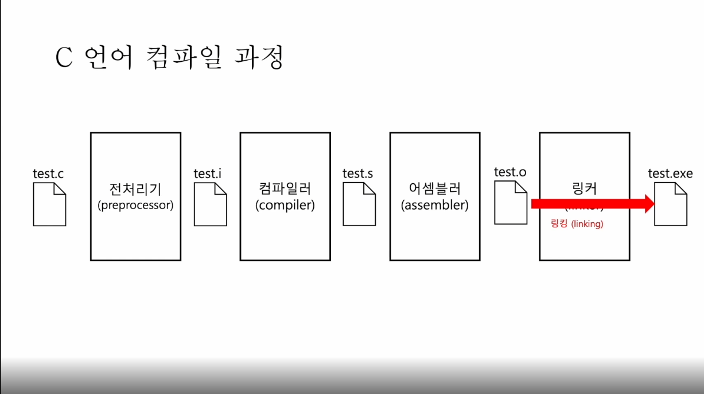

파일명 : 월_주차_이름

<b>문제 : c언어 컴파일 과정을 그림으로 그리고(4단계) 각 과정을 한줄정도로 짧게 설명하시오.</b>

<b>출제 이유 :</b>

그냥 지나칠 수 있는 컴파일 과정을 알고가자는 의미에서 출제했습니다.

<b>답안 : 전처리 과정(preprocessing): 컴파일 영역 명시, 외부에 선언된 소스 코드 및 라이브러리 등을 처리한다. 
컴파일 과정(Compiling): 전처리된 코드를 컴파일러(compiler)가 분석하여 어셈블리어(assembly language)로 번역함. 
어셈블 과정(Assembling): 어셈블러(assembler)가 어셈블리어를 기계어(object code)로 번환. 
링크 과정(Linking): 링커(linker)가 각기 다른 목적코드를 라이브러리 등을 결합하여 하나의 실행 가능한 파일(.exe)로 생성하는 과정. 제공 답안은 참고용으로 하고, 과정마다의 핵심 단어를 썻는지를 체크할 것.
</b>
  

