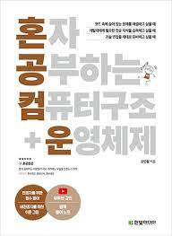

---

## **한성과 컴퓨터 - 컴퓨터 구조 & 운영체제 기초반**
HSAC Computer Architecture & Operating System Fundamental

컴퓨터 구조와 운영체제에 대한 지식을 학습하고, 이를 면접에서 어떻게 활용할 지에 대해서 고민하는 학습 스터디입니다.

---
 ## 📢 Notice
> 2023-04-06 readme.md 수정

- 기존에 언급한 대로, 스터디의 원활한 운영을 위해서 각 기초반에서 벌금제도가 본격적으로 적용될 예정입니다. 
    - 특별한 사정 없이 스터디에 불참 시, 3000원의 벌금이 부과됩니다.
    - 주어진 과제를 하지 않았을 경우, 3,000원의 벌금이 부과됩니다. (질문 포함)
    - 기타, 튜터 혹은 팀장의 판단하에 최대 10,000원의 벌금이 부가될 수 있습니다.

- 중간고사 기간은 4월 3주차부터 4월 4주차까지이며, 해당 기간 동안 스터디의 대면/비대면 활동은 없습니다. 다만, 주어진 진도에 대해서는 학습하셔야 합니다. -추후 문제를 통해 확인 예정-

- 앞으로 매주 스터디 시작 전 각자가 제출해야 하는 문제는 GitHub PullRequest나 Discord 컴퓨터 구조 게시판을 통해 받도록 하겠습니다. (카카오톡을 통한 자료 제출 X)

---

## 📖 Study Plan

 컴퓨터 구조 + 운영체제 기초 학습 계획입니다! 

  

 <b>사용 서적 : </b> 혼자 공부하는 컴퓨터 구조 + 운영체제 

 <b>난이도 : </b>  초급 😁  

 <b>시간 : </b> 월요일 오후 6시 ~ 7시, 수요일 오후 1시 ~ 2시 

 <b>개요 : </b> 

- 
 컴퓨터 구조를 처음 배우시는 분들을 위하여 최대한 쉬운 책을 엄선했습니다. 또한 인프런에서 해당 강의에 대한 인터넷 강의를 무료로 제공하고 있습니다. 책을 구매하셔도 좋지만, 책 없이 강의 내용만 들으셔도 충분하실 것 같아요! 

- 
 저희는 대면시간에 파티 퀘스트라 하여 스터디원분들이 협동하여 여러분들께 5, 6개 정도의 문제를 같이 푸는 시간을 가집니다. 스터디원 분들과 협동하여 해당 문제를 모두 푸시면, 빠르게 퇴근하실 수(?) 있습니다. 하지만 제한시간내로 문제 풀이에 실패할 경우, 어마무시한 과제가 부여됩니다... 😬

---
## 📌Nevigation

 <b>원하는 파일로 빠르게! 하이퍼 링크를 모아보았습니다!</b>

### **[ 학습 디렉터리 ]**

 💌 문제 올리기 게시판 

 📓 질문 할래요! 게시판 

 🥇 대면 스터디 활동 게시판 

### **[ 커뮤니티, 인터넷 강의 ]**

 🎯 한성과 컴퓨터 디스코드 채널 

 🏢 컴퓨터 구조 + 운영체제 인터넷 강의(무료) 

 
---

## 😄 Study Members

박종범, 박채영, 형유림, 이소민, 장동익, 전가연, 전지훈, 김윤섭

---

