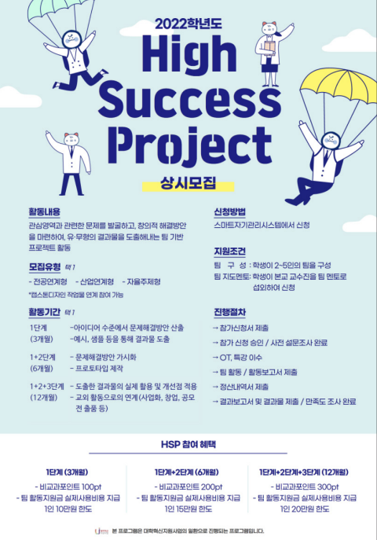

## **💻 한성과 컴퓨터 - 모바일 개발 A반**
HSAC - Android Programming Team A

  
  
  

    🤹‍♀️🤹‍♂️ 안드로이드를 기반으로 모바일 어플리케이션을 개발/학습하고 있는 개발팀입니다. 🤹‍♀️🤹‍♂️

---

## **😄 Study Members**

    👨‍🔧박종범(조장) 
    👩‍🌾김은비 👩‍🎨안가은 👨‍✈️이종범
    🕵️‍♂️이학현 👩‍🚒이소민 🧙‍♂️박지원

---
 ## **📢 Notice**
> 2023-04-07 readme.md 수정

    4월 3주차 ~ 4주차는 중간고사 기간으로, 별도의 대면활동은 없습니다.
    하지만 진도는 그대로 나가니 참고해주세요!

    4월 2주차 학습 범위는 4주차 명언 앱 만들기까지 입니다!

---

## **📖 Plan / Rule**

본격적인 토이프로젝트 학습을 진행하기 앞서 해당 강의를 모두 수강할 계획입니다.

[1. 앱 8개를 만들면서 배우는 안드로이드 코틀린 : 왕초보편](https://inf.run/kVea)\
[2. 커뮤니티 앱 만들기 : 초보편](https://inf.run/ibSz)

이후 [Git을 통한 협업](https://youtu.be/1I3hMwQU6GU)에 대해 학습한 후, 간단한 토이 프로젝트를 진행할 계획입니다.

 

간단한 토이프로젝트로 합을 맞춰본 뒤, `교내 공모전`, `교외 공모전` 출품을 준비할 계획입니다.

### [2023 High Success Project]

2023학년도 1학기 기말고사 종료 후, 여름방학부터 본격적으로 프로젝트를 진행하게 됩니다. 단순히 안드로이드 프로그래밍을 하는 것을 넘어, 추가로 필요한 기술스택에 대한 학습을 진행하게 됩니다.

 

### [2023 C&C Festival]

High Success Project가 끝나고, 이후 준비할 프로젝트입니다.

---

## 🚩 Team Project
현재 진행중인 팀 프로젝트에 대해서 작성합니다.

---