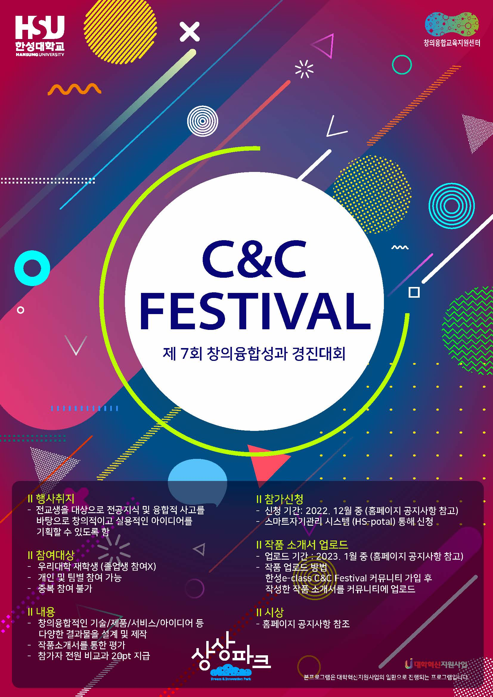

## **💻 한성과 컴퓨터 - 모바일 개발 B반**
HSAC - Android Programming Team B

  
  
  

    🤹‍♀️🤹‍♂️ 안드로이드를 기반으로 모바일 어플리케이션을 개발/학습하고 있는 개발팀입니다. 🤹‍♀️🤹‍♂️

---

## **😄 Study Members**

    👩‍⚖️박채영(조장)
    👩‍🌾전지원, 👩‍🏫조유진, 👨‍🔧김민찬

---
 ## **📢 Notice**
> 2023-04-07 readme.md 수정

    [4월 21일은 중간고사 기간으로, 대면 스터디는 진행하지 않으며 각자 집에서 실습하는 것으로 대체합니다.]
    [5월 5일은 어린이 날로 공휴일이기 때문에 대면, 비대면 희망 수요조사를 통해 비대면으로 진행하도록 하겠습니다.]
    [5월 12일은 축제 기간으로 조원분들의 투표를 통해 비대면으로 진행하도록 하겠습니다.]
    
    👩‍💻 3.31  스터디 1차 진행, 간단한 자기소개 및 앞으로의 활동 계획 수립
    👩‍💻 4.7   스터디 2차 진행, 인프런 강의 섹션 0 ~ 섹션 1 강의 시청 및 실습
    👩‍💻 4.14  스터디 3차 진행, 인프런 강의 섹션 2 강의 시청 및 실습 
    👩‍💻 4.21  (중간고사 기간-비대면), 각자 집에서 인프런 강의 섹션 3 ~ 섹션 5 강의 시청 및 실습
    👩‍💻 4.28  스터디 4차 진행, 인프런 강의 섹션 6 강의 시청 및 실습 
    👩‍💻 5.5   (공휴일 어린이날-비대면), 인프런 강의 섹션 7 강의 시청 및 실습 
    👩‍💻 5.12  스터디 6차 진행, 인프런 강의 섹션 8 강의 시청 및 실습
    👩‍💻 5.19  스터디 7차 진행, 간단한 프로젝트 아이디어 구상 및 실습
    👩‍💻 5.26  스터디 8차 진행, 프로젝트 발표(코드 업로드 예정)

---

## **📖 Plan / Rule**

    TEAM A 와 마찬가지로, 토이프로젝트 학습을 진행하기에 앞서 해당 강의를 수강하며 공부할 예정입니다.
    
    [1. 앱 8개를 만들면서 배우는 안드로이드 코틀린 : 왕초보편](https://inf.run/kVea)

이후 [Git을 통한 협업](https://youtu.be/1I3hMwQU6GU)에 대해 학습한 후, 간단한 토이 프로젝트를 진행할 계획입니다.

 

    간단한 토이프로젝트로 합을 맞춰본 뒤, `교내 공모전`, `교외 공모전` 출품을 준비할 계획입니다.

    ### [2023 High Success Project]

2023학년도 1학기 기말고사 종료 후, 여름방학부터 본격적으로 프로젝트를 진행하게 됩니다. 단순히 안드로이드 프로그래밍을 하는 것을 넘어, 추가로 필요한 기술스택에 대한 학습을 진행하게 됩니다. 

    ### [2023 C&C Festival]

High Success Project가 끝나고, 이후 준비할 프로젝트입니다.
---

## 🚩 Team Project
    현재 진행중인 팀 프로젝트에 대해서 작성합니다.

---
