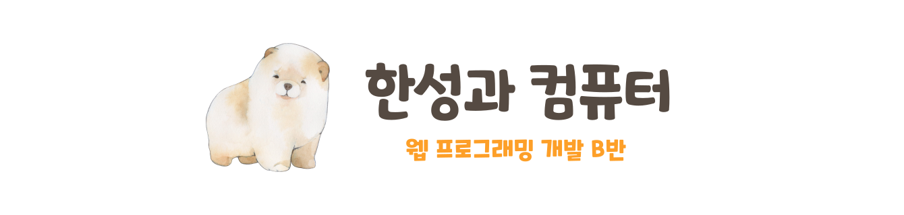

## **한성과 컴퓨터 - 웹 프로그래밍 개발 B반**
HSAC - Web Programming B\

    🤹‍♀️🤹‍♂️ 웹 백엔드 관련 학습을 진행하고 있는 웹 프로그래밍 개발 B반입니다   🤹‍♀️🤹‍♂️

---

## **😄 Study Members**

    👩‍⚖️김기환(조장)
    👩‍🌾차민정, 🤵장동익

---
 ## **📢 Notice**
> 2023-04-09 readme.md 수정

    스터디 공지입니다.

---

## **📖 Plan / Rule**

    스터디 학습 계획을 작성하는 공간입니다.

---

## 🚩 Team Project
    현재 진행중인 팀 프로젝트에 대해서 작성합니다.

---
